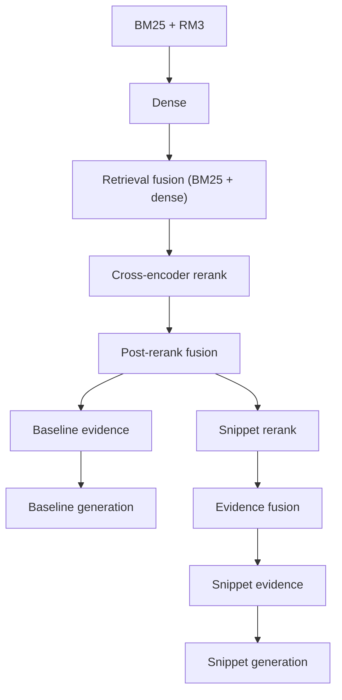

# Public scripts (retrieval pipeline)

This directory is the **[RAG-scripts](https://github.com/fulaibaowang/RAG-scripts)** hybrid retrieval and reranking stack: BM25 + RM3, dense HNSW retrieval, retrieval fusion (RRF), cross-encoder reranking, optional post-rerank fusion, optional snippet-RRF, evidence construction, and LLM generation.

## What the pipeline does

- **Baseline route:** BM25 → Dense → retrieval fusion → cross-encoder → post-rerank RRF → baseline evidence → baseline generation.
- **Optional snippet-RRF route:** snippet window rerank → final doc/snippet fusion → snippet evidence → snippet generation.



Output layout (directories, fusion names, run format, logs): [docs/output.md](docs/output.md).

## Quickstart

**Docker (recommended)** TODO: add demo here

```bash
docker build -t rag-scripts .
```

## Running the pipeline (high level)

1. Copy an example env ([workflow_config_baseline.env](workflow_config_baseline.env), [workflow_config_full.env](workflow_config_full.env)) or create your own.
2. Set `WORKFLOW_OUTPUT_DIR`, query `.jsonl` paths (`INPUT_JSONL` / `INPUT_BATCH_JSONLS`), index paths, and `DOCS_JSONL` for reranking or building evidence.
3. From **this directory**:

   ```bash
   ./run_retrieval_rerank_pipeline.sh --config /path/to/your.env
   ```

   Use `--no-rerank` for retrieval only; `--no-generation` to skip LLM calls; `RUN_SNIPPET_RRF=1` for the snippet route.

Stages whose key outputs already exist are skipped. Per-stage **standalone** commands: [docs/USAGE.md](docs/USAGE.md).

## Entrypoint scripts

| Role | Path |
|------|------|
| Orchestrator | [run_retrieval_rerank_pipeline.sh](run_retrieval_rerank_pipeline.sh) |
| BM25 index | [index/build_bm25_index_from_jsonl_shards.py](index/build_bm25_index_from_jsonl_shards.py) |
| Dense index | [index/build_dense_hnsw_index_from_jsonl_shards.py](index/build_dense_hnsw_index_from_jsonl_shards.py) |
| LLM answers | [generation/generate_answers.py](generation/generate_answers.py) |

Other stage scripts are invoked by the orchestrator; see [docs/USAGE.md](docs/USAGE.md) for direct CLI examples.

## Input and output schema (JSONL examples)

The pipeline uses **one JSON object per line** (JSONL). 

### Input query JSONL

Each line is a single question. You must be able to resolve an **`id`** (`id`, `qid`, or `query_id`). The retrieval topic text is read from **`body`**, or **`query_text`**. Optional **`query_type`** or **`type`**. 

```json
{
  "query_id": "67d723d918b1e36f2e000039",
  "query_text": "Are there biomarkers of depression?"
}
```

### Post-rerank JSONL output

Carries the question fields with retrieved **`doc_ids`** in rank order.

```json
{
  "id": "680fe1e3353a4a2e6b00000f",
  "body": "Is a single-nucleotide polymorphism (SNP) the same as a mutation?",
  "doc_ids": ["26173390", "28431642", "21453671", "30498395", "12741168"]
}
```

#### Snippet route (example outputs)

```json
{
  "id": "680fe1e3353a4a2e6b00000f",
  "body": "Is a single-nucleotide polymorphism (SNP) the same as a mutation?",
  "doc_ids": ["26173390", "28431642"],
  "doc_snippet_windows": {
    "26173390": [
      { "window_idx": 2, "ce_score": 12.5 },
      { "window_idx": 7, "ce_score": 9.1 }
    ],
    "28431642": [
      { "window_idx": 0, "ce_score": 11.0 }
    ]
  }
}
```

### Generation output JSONL (`*_answers.jsonl`)

Written by `generation/generate_answers.py` from a **contexts** JSONL (e.g. output of `build_contexts_from_*.py`). Each output line is the input record **plus** model fields. On success: **`ideal_answer`** (string), **`evidence_ids`** (strings matching context `id` values, e.g. `PMID-1`), and for `yesno` / `factoid` / `list` also **`exact_answer`**. On failure, those may be null and an **`error`** string is set.

```json
{
  "id": "680fe1e3353a4a2e6b00000f",
  "body": "Is a single-nucleotide polymorphism (SNP) the same as a mutation?",
  "doc_ids": ["26173390", "28431642"],
  "contexts": [
    {
      "id": "26173390-1",
      "doc_id": "26173390",
      "text": "Title: …\n\nAbstract: …"
    }
  ],
  "ideal_answer": "No. SNPs are defined as common variants (often ≥1% frequency), whereas “mutation” often denotes rarer or pathogenic change; usage overlaps and context matters.",
  "evidence_ids": ["26173390-1", "28431642-1"]
}
```

## Prerequisites

- Python environment with pipeline dependencies (PyTerrier, hnswlib, sentence-transformers, pandas, …).

Python dependencies are pinned in [requirements-docker-pytorch.txt](requirements-docker-pytorch.txt) and [requirements-docker.txt](requirements-docker.txt).

**Local venv (optional):** install a matching `torch` for your OS/GPU from [pytorch.org](https://pytorch.org), then `pip install -r requirements-docker-pytorch.txt` and `pip install -r requirements-docker.txt`. You still need Java and the system packages installed in the [Dockerfile](Dockerfile).

- Terrier BM25 index and dense HNSW index (see [docs/USAGE.md](docs/USAGE.md)).

## related repo

- [BioASQ](https://github.com/fulaibaowang/BioASQ/blob/main/README.md).
