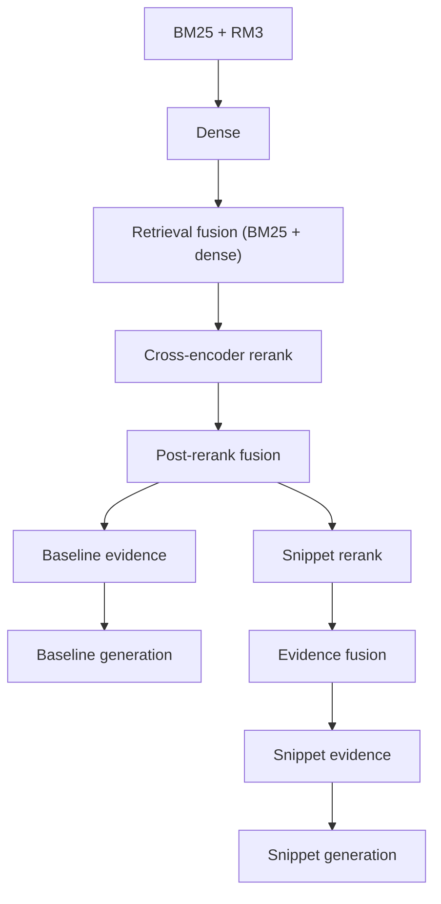

# Public scripts (retrieval pipeline)

This directory is the **shared** hybrid retrieval and reranking stack: BM25 + RM3, dense HNSW retrieval, retrieval fusion (RRF), cross-encoder reranking, optional post-rerank fusion, optional snippet-RRF, evidence construction, and LLM generation. 

## What the pipeline does

- **Baseline route:** BM25 → Dense → retrieval fusion → cross-encoder → post-rerank RRF → baseline evidence → baseline generation.
- **Optional snippet-RRF route:** snippet window rerank → final doc/snippet fusion → snippet evidence → snippet generation.



Output layout (directories, fusion names, run format, logs): [docs/output.md](docs/output.md).

## Quickstart

**Docker (recommended)** reproduces Java 21, CUDA 12.8 / PyTorch cu128, Terrier, and Python dependencies. Build and run from the repo root are documented step-by-step in [docs/USAGE.md](../../../docs/USAGE.md).

**Local venv (optional):** install a matching `torch` for your OS/GPU from [pytorch.org](https://pytorch.org), then from the repo root `pip install -r requirements-docker.txt` and [requirements-docker-pytorch.txt](../../../requirements-docker-pytorch.txt) as needed. You still need Java and the system libraries the [Dockerfile](../../../Dockerfile) installs.

## Running the pipeline (high level)

1. Copy an example env ([workflow_config_baseline.env](workflow_config_baseline.env), [workflow_config_full.env](workflow_config_full.env)).
2. Set `WORKFLOW_OUTPUT_DIR`, query `.jsonl` paths (`INPUT_JSONL` / `INPUT_BATCH_JSONLS`), index paths, and `DOCS_JSONL` when reranking or building evidence.
3. From the repo root:

   ```bash
   ./scripts/public/shared_scripts/run_retrieval_rerank_pipeline.sh --config /path/to/your.env
   ```

   Use `--no-rerank` for retrieval only; `--no-generation` to skip LLM calls; `--snippet-rrf` or `RUN_SNIPPET_RRF=1` for the snippet route.

Stages whose key outputs already exist are skipped. Per-stage **standalone** commands and argument lists: [docs/USAGE.md](docs/USAGE.md).

## Entrypoint scripts

| Role | Path |
|------|------|
| Orchestrator | [run_retrieval_rerank_pipeline.sh](run_retrieval_rerank_pipeline.sh) |
| BM25 index | [index/build_bm25_index_from_jsonl_shards.py](index/build_bm25_index_from_jsonl_shards.py) |
| Dense index | [index/build_dense_hnsw_index_from_jsonl_shards.py](index/build_dense_hnsw_index_from_jsonl_shards.py) |
| LLM answers | [generation/generate_answers.py](generation/generate_answers.py) |

Other stage scripts are invoked by the orchestrator; see [docs/USAGE.md](docs/USAGE.md) for direct CLI examples.

## Prerequisites

- Python environment with pipeline dependencies (PyTerrier, hnswlib, sentence-transformers, pandas, …).
- Terrier BM25 index and dense HNSW index (see [docs/USAGE.md](docs/USAGE.md)).
- Query streams as `.jsonl` (see [docs/PARAMETERS.md](docs/PARAMETERS.md) and [scripts/public/README.md](../README.md) for format conversion).

Run artifacts use **TSV runs** (`qid`, `docno`, `rank`, `score`) under each stage’s `runs/` directory; see [docs/output.md](docs/output.md). Pipeline and Python **logging**, snippet **window** sidecars, and HF verbosity defaults are also described there.
