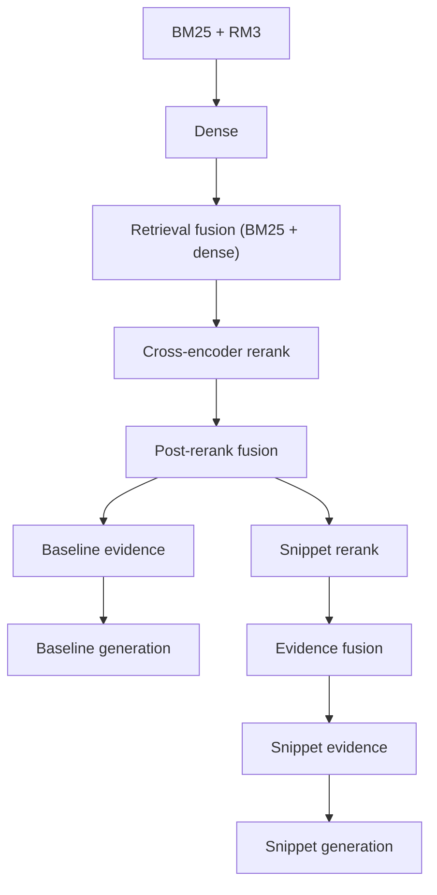

# Public scripts (retrieval pipeline)

This directory is the **[RAG-scripts](https://github.com/fulaibaowang/RAG-scripts)** hybrid retrieval and reranking stack: BM25 + RM3, dense HNSW retrieval, retrieval fusion (RRF), cross-encoder reranking, optional post-rerank fusion, optional snippet-RRF, evidence construction, and LLM generation. When embedded in the [BioASQ](https://github.com/fulaibaowang/BioASQ) repository, it appears as `scripts/public/shared_scripts/`.

## What the pipeline does

- **Baseline route:** BM25 → Dense → retrieval fusion → cross-encoder → post-rerank RRF → baseline evidence → baseline generation.
- **Optional snippet-RRF route:** snippet window rerank → final doc/snippet fusion → snippet evidence → snippet generation.



Output layout (directories, fusion names, run format, logs): [docs/output.md](docs/output.md).

## Quickstart

**Docker (recommended)** — from the **root of this tree** (the directory that contains this `README.md` and `Dockerfile`):

```bash
docker build -t rag-scripts .
```

Python dependencies are pinned in [requirements-docker-pytorch.txt](requirements-docker-pytorch.txt) and [requirements-docker.txt](requirements-docker.txt).

**Local venv (optional):** install a matching `torch` for your OS/GPU from [pytorch.org](https://pytorch.org), then `pip install -r requirements-docker-pytorch.txt` and `pip install -r requirements-docker.txt`. You still need Java and the system packages installed in the [Dockerfile](Dockerfile).

**BioASQ** (Docker on host data, task JSON, adapt-in/out): [BioASQ docs/USAGE.md](https://github.com/fulaibaowang/BioASQ/blob/main/docs/USAGE.md).

## Running the pipeline (high level)

1. Copy an example env ([workflow_config_baseline.env](workflow_config_baseline.env), [workflow_config_full.env](workflow_config_full.env)) or create your own.
2. Set `WORKFLOW_OUTPUT_DIR`, query `.jsonl` paths (`INPUT_JSONL` / `INPUT_BATCH_JSONLS`), index paths, and `DOCS_JSONL` for reranking or building evidence.
3. From **this directory**:

   ```bash
   ./run_retrieval_rerank_pipeline.sh --config /path/to/your.env
   ```

   Use `--no-rerank` for retrieval only; `--no-generation` to skip LLM calls; `RUN_SNIPPET_RRF=1` for the snippet route.

Stages whose key outputs already exist are skipped. Per-stage **standalone** commands: [docs/USAGE.md](docs/USAGE.md).

## Entrypoint scripts

| Role | Path |
|------|------|
| Orchestrator | [run_retrieval_rerank_pipeline.sh](run_retrieval_rerank_pipeline.sh) |
| BM25 index | [index/build_bm25_index_from_jsonl_shards.py](index/build_bm25_index_from_jsonl_shards.py) |
| Dense index | [index/build_dense_hnsw_index_from_jsonl_shards.py](index/build_dense_hnsw_index_from_jsonl_shards.py) |
| LLM answers | [generation/generate_answers.py](generation/generate_answers.py) |

Other stage scripts are invoked by the orchestrator; see [docs/USAGE.md](docs/USAGE.md) for direct CLI examples.

## Prerequisites

- Python environment with pipeline dependencies (PyTerrier, hnswlib, sentence-transformers, pandas, …).
- Terrier BM25 index and dense HNSW index (see [docs/USAGE.md](docs/USAGE.md)).
- Query streams as `.jsonl` (see [docs/PARAMETERS.md](docs/PARAMETERS.md)). BioASQ JSON conversion and public script layout: [BioASQ scripts/public/README.md](https://github.com/fulaibaowang/BioASQ/blob/main/scripts/public/README.md).
