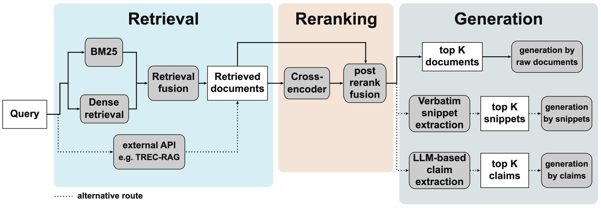

# RAG-scripts

A hybrid retrieval, reranking and generation pipeline: BM25 + RM3, dense HNSW retrieval, retrieval fusion (RRF), cross-encoder reranking, optional post-rerank fusion, optional snippet-RRF, evidence construction, and LLM generation — plus an optional **context distillation** stage (`GENERATION_MODE=claims`) so generation can ingest more evidence than fits a raw prompt.

## What the pipeline does

- **Document route:** BM25 → Dense → retrieval fusion → cross-encoder → post-rerank RRF → document evidence → document generation. (One context per document.)
- **Optional snippet-RRF route:** snippet window rerank → final doc/snippet fusion → snippet evidence → snippet generation. A snippet is a sliding window of **3 sentences** (`SNIPPET_WINDOW_SIZE`, stride 1, so windows overlap); windows are scored against the query and the best ones stand in for the whole document, which keeps the evidence dense when only a small part of a long document is relevant.
- **Optional context distillation:** `GENERATION_MODE=claims` distils contexts into claim slots before the answer prompt; the default `direct` is byte-identical to the plain pipeline. See [docs/PARAMETERS.md](docs/PARAMETERS.md) for this and the other generation-side options.



Output layout (directories, fusion names, run format, logs): [docs/output.md](docs/output.md).

Working on this repo (including with a coding agent): [AGENTS.md](AGENTS.md).

## Quickstart

### Try the demo (self-contained)

```bash
git clone https://github.com/fulaibaowang/RAG-scripts.git
git clone https://github.com/fulaibaowang/RAG-scripts-demo-data.git RAG-scripts/demo
cd RAG-scripts
docker run --rm \
  -v "$PWD:/work" \
  -e HF_HOME=/work/.hf_cache \
  -e HF_HUB_CACHE=/work/.hf_cache/hub \
  -e SENTENCE_TRANSFORMERS_HOME=/work/.hf_cache/sentence_transformers \
  --workdir /work \
  fulaibaowang/bioasq:08.03.26b200 \
  bash -c "./run_retrieval_rerank_pipeline.sh --config demo/config.env"
```

Outputs land in `demo/output/` (BM25 → dense → retrieval fusion → rerank).

### Run on your own data

```bash
git clone https://github.com/fulaibaowang/RAG-scripts.git
cd RAG-scripts
cp conf/workflow_config_document.env my_run.env
# build BM25 + dense indexes first: docs/USAGE.md#indexing
# edit my_run.env: set WORKFLOW_OUTPUT_DIR, INPUT_JSONL, INPUT_BATCH_JSONLS,
#                  BM25_INDEX_PATH, DENSE_INDEX_DIR, DOCS_JSONL
# no gold documents[] on queries? HAVE_GROUND_TRUTH=0 (docs/PARAMETERS.md)
docker run --rm \
  -v "$PWD:/work" \
  -v "/path/to/your/data:/data" \
  -e HF_HOME=/work/.hf_cache \
  --workdir /work \
  fulaibaowang/bioasq:08.03.26b200 \
  bash -c "./run_retrieval_rerank_pipeline.sh --config my_run.env"
```

## Running the pipeline (high level)

1. Copy an example env ([conf/workflow_config_document.env](conf/workflow_config_document.env), [conf/workflow_config_full.env](conf/workflow_config_full.env)) or create your own.
2. Set `WORKFLOW_OUTPUT_DIR`, query `.jsonl` paths (`INPUT_JSONL` / `INPUT_BATCH_JSONLS`), index paths, and `DOCS_JSONL` for reranking or building evidence.
3. From the repository root:

   ```bash
   ./run_retrieval_rerank_pipeline.sh --config /path/to/your.env
   ```

   Use `--no-rerank` for retrieval only; `--no-generation` to skip LLM calls; `RUN_SNIPPET_RRF=1` for the snippet route; `GENERATION_MODE=claims` to distil contexts.

Stages whose key outputs already exist are skipped. Per-stage **standalone** commands: [docs/USAGE.md](docs/USAGE.md).

## Recommended starting point

[docs/PARAMETERS.md](docs/PARAMETERS.md) documents every knob, which is a lot to face at once. If you
have no reason to choose otherwise, start here and change one thing at a time:

| Knob | Start with | Why |
|------|-----------|-----|
| `STAGE1_SOURCE` | `rrf` (default) | BM25 + dense fused beats either alone; use `external` when a hosted first stage already gives you a run |
| Post-rerank fusion | on (default) | fuses the cross-encoder order with the stage-1 order rather than trusting either outright |
| `GENERATION_MODE` | `direct` (default) | switch to `claims` when you need generation to ingest more evidence than fits a raw prompt — it costs an extra LLM pass over every context. `facets` is not recommended |
| `HAVE_GROUND_TRUTH` | `0` if queries have no gold | default is `1`; missing `documents` yields all-zero metrics, not a skip — see [docs/PARAMETERS.md](docs/PARAMETERS.md) |
| Snippet route | off | turn on (`RUN_SNIPPET_RRF=1`) when passage-level evidence beats whole documents for your corpus. It is an alternative to the document route, not a companion to `claims` — snippets are already the relevant span, so distilling claims out of them buys little |

These are defaults for getting a sensible first run, not tuned settings — what wins depends on your
corpus and judge. Per-stage tuning ranges are in [docs/PARAMETERS.md](docs/PARAMETERS.md).

## Entrypoint scripts

| Role | Path |
|------|------|
| Orchestrator | [run_retrieval_rerank_pipeline.sh](run_retrieval_rerank_pipeline.sh) |
| BM25 index | [index/build_bm25_index_from_jsonl_shards.py](index/build_bm25_index_from_jsonl_shards.py) |
| Dense index | [index/build_dense_hnsw_index_from_jsonl_shards.py](index/build_dense_hnsw_index_from_jsonl_shards.py) |
| LLM answers | [generation/generate_answers.py](generation/generate_answers.py) |

Other stage scripts are invoked by the orchestrator; see [docs/USAGE.md](docs/USAGE.md) for direct CLI examples.

### Repo map

| Directory | Contents |
|-----------|----------|
| `index/` | Build the Terrier BM25 and dense HNSW indexes from JSONL shards |
| `retrieval/` | Stage-1 BM25 and dense retrieval, retrieval RRF, multi-field query fusion |
| `rerank/` | Cross-encoder rerank, post-rerank fusion, t\* score cutoff, eval plots |
| `evidence/` | Turn ranked docids into contexts — document contexts, snippet windows, snippet rerank |
| `generation/` | Claim extraction and distillation, answer generation, sentence citation attribution |
| `conf/` | Example workflow configs; copy one and edit |
| `prompts/` | Generation system/user prompt templates and output schemas |
| `docs/` | Parameter reference, per-stage usage, output layout |
| `retrieval_eval/` | Shared metric helpers (recall/nDCG) used by the stage scripts |
| `analysis/` | Standalone post-hoc reports — recall by question, low-recall diagnosis, run comparison. Not part of the pipeline |
| `listwise_script/` | Optional LLM listwise reranker, an alternative to the cross-encoder. Not wired into the orchestrator |
| `ci/` | Mock LLM server and the generation-mode smoke script used by GitHub Actions |
| `utils/` | Logging setup |

## Pointing generation at an LLM

Retrieval and reranking run locally. Generation calls out to a model, and needs to be told which:

```bash
GENERATION_BACKEND=ollama                        # default
OLLAMA_URL=http://127.0.0.1:11434/api/generate   # your ollama serve
GENERATION_MODEL=llama3.3:latest
```

```bash
GENERATION_BACKEND=openai_compat                 # any OpenAI-compatible endpoint
GEN_API_BASE=https://openrouter.ai/api/v1
GENERATION_MODEL=meta-llama/llama-3.3-70b-instruct
```

API keys (`LLAMA_API_KEY` for the ollama path, `GEN_API_KEY` for `openai_compat`) come from the
environment or a repo-root `.env` — never from a committed config.

`openai_compat` covers answer generation only. The optional distillation stage speaks the ollama
API directly, so `GENERATION_MODE=claims` requires the ollama backend and is refused at config time
with a hosted one — pair a hosted model with `GENERATION_MODE=direct`.

> **`OLLAMA_URL` defaults to a local ollama on `127.0.0.1:11434`**, so `ollama serve` on the same
> machine needs no configuration at all. Anything else — a GPU box, a cluster job, a hosted gateway —
> means setting `OLLAMA_URL` in your workflow config (it is `source`d with `set -a`, so it reaches
> the stage scripts); the repo-root `.env` is read for API keys only. If nothing is listening,
> generation stops before the first question and says so, rather than writing a file of error rows.

Run with `--no-generation` to stop after evidence construction and skip this entirely. Timeouts,
context window, token caps, retry behaviour and the checkpoint/resume knobs are all in
[docs/PARAMETERS.md](docs/PARAMETERS.md).

## Input and output schema (JSONL examples)

The pipeline uses **one JSON object per line** (JSONL). **Wire format** for question identity is always **`query_id`**, **`query_text`**, **`query_type`** on read and write (nested **`bioasq`** and duplicate **`id` / `body` / `type`** fields are dropped when loading). Legacy lines that only have `id` / `body` / `type` are still accepted on read and normalized to `query_*`. Converting to and from a task's own submission JSON is the consuming repo's job, not this pipeline's — for BioASQ see [`bioasq_json_to_queries_jsonl.py`](https://github.com/fulaibaowang/BioASQ/blob/main/scripts/public/format/bioasq_json_to_queries_jsonl.py).

### Input query JSONL

Each line is a single question. **`query_id`** is required (after normalization from legacy `id` / `qid` / `bioasq.id` if needed). **`query_text`** is the retrieval topic. **`query_type`** is **optional** and task-specific — BioASQ uses it for the task label (`summary`, `yesno`, `factoid`, `list`); corpora with no such notion simply omit it.

```json
{
  "query_id": "67d723d918b1e36f2e000039",
  "query_text": "Are there biomarkers of depression?",
  "query_type": "summary"
}
```

Docids are whatever your corpus uses — the pipeline never parses them. The examples below are
BioASQ/PubMed, matching the demo data and the Docker image. A TREC-RAG/ClimbMix line carries no
`query_type` and uses shard-style docids, and runs through the same stages unchanged:

```json
{
  "query_id": "rag2026-0",
  "query_text": "I'm on a hospital nursing DEI council that has to recommend a three-year plan..."
}
```

### Corpus JSONL

Each line is a document the indexes and evidence stages look up by `docno`:

```json
{ "docno": "your-id", "title": "...", "text": "..." }
```

Optional gold for eval is a `documents` array on the **query** line (same ids as `docno`). Index build and a new-corpus checklist: [docs/USAGE.md](docs/USAGE.md#indexing). Eval without gold: [docs/PARAMETERS.md](docs/PARAMETERS.md#ground-truth-eval-metrics).

### Post-rerank JSONL output

Carries **`query_*`** plus retrieved **`doc_ids`** in rank order (no document URLs or text here).

```json
{
  "query_id": "680fe1e3353a4a2e6b00000f",
  "query_text": "Is a single-nucleotide polymorphism (SNP) the same as a mutation?",
  "query_type": "yesno",
  "doc_ids": ["26173390", "28431642", "21453671", "30498395", "12741168"]
}
```

#### Snippet route (example outputs)

```json
{
  "query_id": "680fe1e3353a4a2e6b00000f",
  "query_text": "Is a single-nucleotide polymorphism (SNP) the same as a mutation?",
  "query_type": "yesno",
  "doc_ids": ["26173390", "28431642"],
  "doc_snippet_windows": {
    "26173390": [
      { "window_idx": 2, "ce_score": 12.5 },
      { "window_idx": 7, "ce_score": 9.1 }
    ],
    "28431642": [
      { "window_idx": 0, "ce_score": 11.0 }
    ]
  }
}
```

### Generation output JSONL (`*_answers.jsonl`)

Written by `generation/generate_answers.py` from a **contexts** JSONL (e.g. output of `build_contexts_from_*.py`). Each output line is the input record **plus** model fields. On success: **`ideal_answer`** (string), **`evidence_ids`** (strings matching context `id` values — `<docid>-<n>`, e.g. `PMID-1` on PubMed, `shard_00122_5199-1` on ClimbMix), and for `yesno` / `factoid` / `list` also **`exact_answer`**. On failure, those may be null and an **`error`** string is set.

An optional post-generation pass can attribute each answer *sentence* back to the documents behind it, adding an `answer_sentences` field and leaving the rest of the row untouched — see `CITATION_GRANULARITY` in [docs/PARAMETERS.md](docs/PARAMETERS.md).

```json
{
  "query_id": "680fe1e3353a4a2e6b00000f",
  "query_text": "Is a single-nucleotide polymorphism (SNP) the same as a mutation?",
  "query_type": "yesno",
  "doc_ids": ["26173390", "28431642"],
  "contexts": [
    {
      "id": "26173390-1",
      "doc_id": "26173390",
      "text": "Title: …\n\nAbstract: …"
    }
  ],
  "ideal_answer": "No. SNPs are defined as common variants (often ≥1% frequency), whereas “mutation” often denotes rarer or pathogenic change; usage overlaps and context matters.",
  "evidence_ids": ["26173390-1", "28431642-1"]
}
```

## Prerequisites

Dense retrieval and cross-encoder reranking want a GPU; they run on CPU but slowly. BM25 and fusion
are CPU-only. Index building is the memory-hungry step — budget for the corpus, not the queries.

- A Python environment with the pipeline dependencies (PyTerrier, hnswlib, sentence-transformers, pandas, …), pinned in [requirements-docker-pytorch.txt](requirements-docker-pytorch.txt) and [requirements-docker.txt](requirements-docker.txt).
- A Terrier BM25 index and a dense HNSW index — build both with the `index/` scripts (see [docs/USAGE.md](docs/USAGE.md)).
- An LLM endpoint, only if you run generation (`--no-generation` skips it).

The Docker image above carries all of this. **Local venv (optional):** install a matching `torch` for your OS/GPU from [pytorch.org](https://pytorch.org), then `pip install -r requirements-docker-pytorch.txt` and `pip install -r requirements-docker.txt`. You still need Java and the system packages installed in the [Dockerfile](Dockerfile).

## License

Apache-2.0. See [LICENSE](LICENSE).

## Related repos

This pipeline is shared by several projects, which drive it over different corpora. Task-specific
submission formatting lives in those repos, not here.

- [BioASQ](https://github.com/fulaibaowang/BioASQ) — biomedical question answering over PubMed.
- [trec-rag](https://github.com/fulaibaowang/trec-rag) — TREC RAG, over the ClimbMix web corpus. *Going public soon.*
- [dictycite](https://github.com/fulaibaowang/dictycite) — literature curation for dictyBase.
